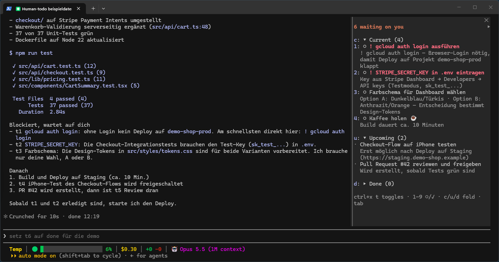

# human-todo

A Claude Code mod that keeps a sidebar of the things **you** have to do during a session —
the login only you can run, the design only you can approve, the device only you can test on.
Claude adds them; you tick them off; Claude is told.



## Features

- **Three groups**: Current, Upcoming, Done — each collapsible (click or Enter on its header).
- **Resolve in place**: press `○` to mark a todo done, `✓` to reopen it.
- **Claude gets told**: every change wakes Claude, which picks up the work that was waiting
  on you right away. Or have it read the change with your next message (see Settings).
- **Theme colors**: current = theme `warning`, upcoming = `suggestion`, done = `success`,
  high priority = `error` with `!`. Follows whatever theme you picked in `/config`.
- **Collapsible sidebar**: collapses to a single line above the prompt
  (`◂ todos  1 current  2 upcoming  ctrl+x t`).
- **Shortcut**: `ctrl+x t` toggles the sidebar — identical on Windows and macOS.
- **Keyboard only**: opening with `ctrl+x t` (or `/human-todo`) gives the sidebar the keyboard,
  the ring on the first open todo. `1`–`9` resolve/reopen the rows as numbered, `c`/`u`/`d` fold
  Current/Upcoming/Done, Tab/Enter walk and press, Esc hands the keys back (sidebar stays).
  After a resolve the ring moves to the next todo of that section. Collapsed: `ctrl+x tab`, then
  `t` or Enter, opens it. (Focus is only taken over an empty prompt; else `ctrl+x tab`.)
- `/human-todo` toggles the sidebar too; `/human-todo add <text>` adds a todo of your own.

## Install

Requires a Claude Code build with function-hook mods (2.1.289 or newer). At the prompt of a
terminal session, type:

```
/plugin install human-todo --marketplace bac83/human-todo
```

Answer `y` to add the marketplace, then pick a scope (user = every session) and set the
options. The sidebar is active right away, no restart.

Update later with `claude plugin update human-todo@human-todo`, then `/reload-plugins`.

## Settings (`/config`)

| Setting | Default | What it does |
| --- | --- | --- |
| `shortcut` | `ctrl+x t` | Chord that toggles the sidebar. Empty = no shortcut. |
| `wakeClaude` | `true` | On: resolving a todo starts a turn so Claude reacts at once (each toggle is a turn). Off: Claude reads it with its next request. |

### About the shortcut

Claude Code has no keybinding actions of a plugin's own, so the sidebar's toggle buttons borrow the
built-in action `app:toggleDiffPreSession` (no default key). On load the mod adds
`"ctrl+x t": "app:toggleDiffPreSession"` to the `Global` context of `~/.claude/keybindings.json`
(or `$CLAUDE_CONFIG_DIR/keybindings.json`). A binding you made for that action yourself is kept.

## Tools Claude gets

| Tool | Purpose |
| --- | --- |
| `mcp__human-todo__add_todo` | Hand the user an action item (`title`, `detail`, `priority`, `status`). |
| `mcp__human-todo__update_todo` | Move, reword or close a todo by id. |
| `mcp__human-todo__list_todos` | List this session's todos. |

Todos live for the session (they survive a mod reload, not a restart).

## Develop

Run it from a clone instead of the installed copy:

```sh
git clone https://github.com/bac83/human-todo.git
claude --plugin-dir ./human-todo
```

To load the clone in every session without the flag, add the folder to `CLAUDE_CODE_PLUGIN_DIRS`
in the `env` block of `~/.claude/settings.json`:

```json
{ "env": { "CLAUDE_CODE_PLUGIN_DIRS": "/absolute/path/to/human-todo" } }
```

(Windows: `C:\\path\\to\\human-todo`; several folders are separated with `;` on Windows, `:` on macOS/Linux.)

Checks:

```sh
claude plugin validate .
claude plugin test .
tsc -p .            # after one load, which lays .claude-plugin/types/
```

`describeChange()` in `hooks/register.tsx` decides the words Claude reads when you change a todo.

## License

MIT, see [LICENSE](LICENSE).
